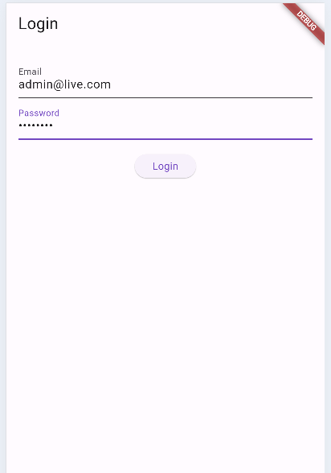

# Simple POS Interface for Inventory Management

## Overview
This project is a basic Point of Sale (POS) interface built using Flutter for inventory and transaction management. It connects to a Laravel API (mysql database) to handle the backend data processing. The app includes key screens to manage items and view sales history.

## Features
### Login Screen (with api credentials).

### Home Screen: Displays item categories and a cart summary.

### Product List Screen: Shows available products with a search/filter feature.

### Cart/Checkout Screen: Edit items from the cart, calculate total costs.

### Sales History Screen: View past sales transactions (data from api).

## Functionalities:
### Add items to a cart and proceed to checkout (from home screen).

### Display the current stock of each item (from product list screen).

### Update stock levels after each transaction.

### View recent transactions (from sales history screen).

## Project Setup
### Prerequisites
**Flutter SDK**

**Laravel API:** Ensure your Laravel API is set up and running.

## Clone the Repository

**git clone https://github.com/samer-nasr/pos-flutter.git**

**cd pos-flutter**

## Flutter Setup
Install dependencies Run the following command to install all the required Flutter packages:

**flutter pub get**

## Run the app Launch the Flutter app on a connected device or simulator:

**flutter run**

## Laravel API Setup

## Clone the Laravel API

**git clone https://github.com/samer-nasr/pos-backend.git**

**cd pos-backend**

## Install dependencies Run the following command to install all the required Laravel packages:

**composer install**

## Setup the environment file Copy .env.example to .env and configure your database and API keys:

**cp .env.example .env**

**php artisan key:generate**

## Migrate the database Run the following command to migrate the database tables:

**php artisan migrate**

## Seed the database :

**php artisan db:seed**

## Run the Laravel API Start the server:

**php artisan serve**

## API Endpoints:

**GET /api/items:** Fetch all available items

**GET /api/category_items:** Return an array of categories each category contains an array of items belongs to

**POST /api/login:** Verifie the login credentials

**GET /api/carts:** Return an array of carts contains total cart price and an array of cart items

**POST /api/add_cart:** Create a new cart in the database

**POST /api/add_cartItem:** Create a cart item in the database

## Credits
### Flutter: https://flutter.dev
### Laravel: https://laravel.com

## Screenshots:

### Login Page:

### Home Page:

### Home Page Items:

.

### Home Page After Adding Items To Cart:

.

### Product List Page:

.

### Product List With Search Functionality:

### Cart Checkout Page:

### Sales History Page:

## API Screenshot:

